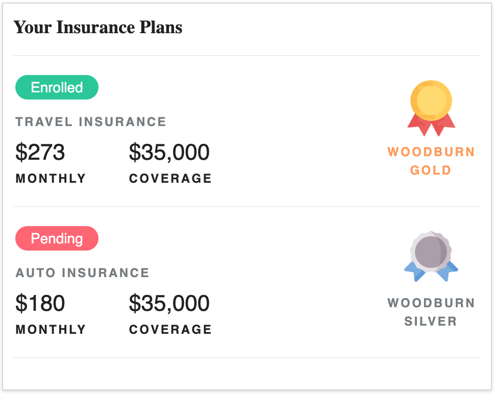

# Woodburn Insurance - User Insurance



## PreRequisites
Check the list of pre-requisites [here](https://opensource.hcltechsw.com/digital-experience/CF207/guide_me/tutorials/scriptapps/pre_requisites/).

#  How To Build and Deploy This Sample Application
1. Update the project [WBIUserInsurance/package.json](./package.json) file to point to the target DX core instance.
    ```
    {
        "config": {
           "dxclient": {
               "wcmContentName": "wbi-dashboard-user-insurance",
               ...
               "protocol": "https",
               "hostname": "localhost",
               "port": "10041"
           }
        },
    }
    ```
2. Test the React App in local browser:
    ```
        cd WBIUserInsurance
        npm install
        npm start
    ```
3. Build your application as-usual:
    ```
        cd WBIUserInsurance
        npm install
        npm run build
    ```
4. Execute the npm script dx-deploy-app, pre-set with the DX admin username and password.

        dxUsername=<username> dxPassword=<password> npm run dx-deploy-app 
            > sample-app@0.1.0 dx-deploy-app
            > dxclient deploy-scriptapplication push -dxUsername $dxUsername -dxPassword $dxPassword -wcmContentName "$npm_package_config_dxclient_wcmContentName" -wcmSiteArea "$npm_package_config_dxclient_wcmSiteArea" -mainHtmlFile $npm_package_config_dxclient_mainHtmlFile -contentRoot "$npm_package_config_dxclient_contentRoot" -dxProtocol $npm_package_config_dxclient_protocol -hostname $npm_package_config_dxclient_hostname -dxPort $npm_package_config_dxclient_port
         
            2022-08-08 21:13:36 : Begin content push to Portal.
            2022-08-08 21:13:36 : WCM content ID: .
            2022-08-08 21:13:36 : WCM Content Path: .
            2022-08-08 21:13:36 : WCM Content Title: .
            2022-08-08 21:13:36 : Main HTML file: index.html.
            2022-08-08 21:13:36 : PrebuiltZip path does not exist.
            2022-08-08 21:13:36 : Archive file: 

            /var/folders/mp/bcmnxk3s0rbbj1cbbl0875bw0000gn/T/tmp--14373-oFwJoCUJU4yG-.zip
            (51965 bytes in 5 files) 

            131.d190506afae2cd09f1fd.bundle.js
            index.html
            main.269f6c0111b67c725c63.bundle.js
            main.269f6c0111b67c725c63.bundle.js.LICENSE.txt
            main.9a71fbc56a658baede15.css.
            2022-08-08 21:13:39 : Content push was successful.
            2022-08-08 21:13:39 : End content push to Portal.
            2022-08-08 21:13:39 : Body content: {"results":{"status":"success","importedFiles":{"file":[{"filename":"HTML/index.html"},{"filename":"JavaScript/main.269f6c0111b67c725c63.bundle.js"},{"filename":"JavaScript/131.d190506afae2cd09f1fd.bundle.js"},{"filename":"CSS/main.9a71fbc56a658baede15.css"}]},"skippedFiles":"","message":"The file that you selected was imported successfully.","contentId":"6fa0b659-7b18-499d-a8de-090a0e9f8987"}}.     

5. In case of errors, check the details in the DXClient logs in the WBIUserInsurance/store/logs/logger.log file.
6. Prepare your target DX page that will host the WBIUserInsurance ScriptApp. Follow the steps listed [here](https://opensource.hcltechsw.com/digital-experience/CF207/guide_me/tutorials/scriptapps/common-setup/post-deployment/prepare_dx_page/).
7. Add the WBIUserInsurance ScriptApp (matching the wcmContentName in the package.json config) into the target DX test page. Follow the steps listed [here](https://opensource.hcltechsw.com/digital-experience/CF207/guide_me/tutorials/scriptapps/common-setup/post-deployment/add_scriptapp_to_page/).

## How To Bundle and Deploy New or Existing ReactJS Application to DX Without Its Dependencies
For the detailed discussion of the important scripts and configuration that you'll need for your own projects, follow this [How-To Guide](https://opensource.hcltechsw.com/digital-experience/CF207/guide_me/tutorials/scriptapps/how_to/03_apps_excluding_dependencies/).

## Support

In case of questions or issues please raise via Issues tab in this GitHub repository. HCL Support will make every reasonable effort to assist in problem resolution of any issues found in this software.
